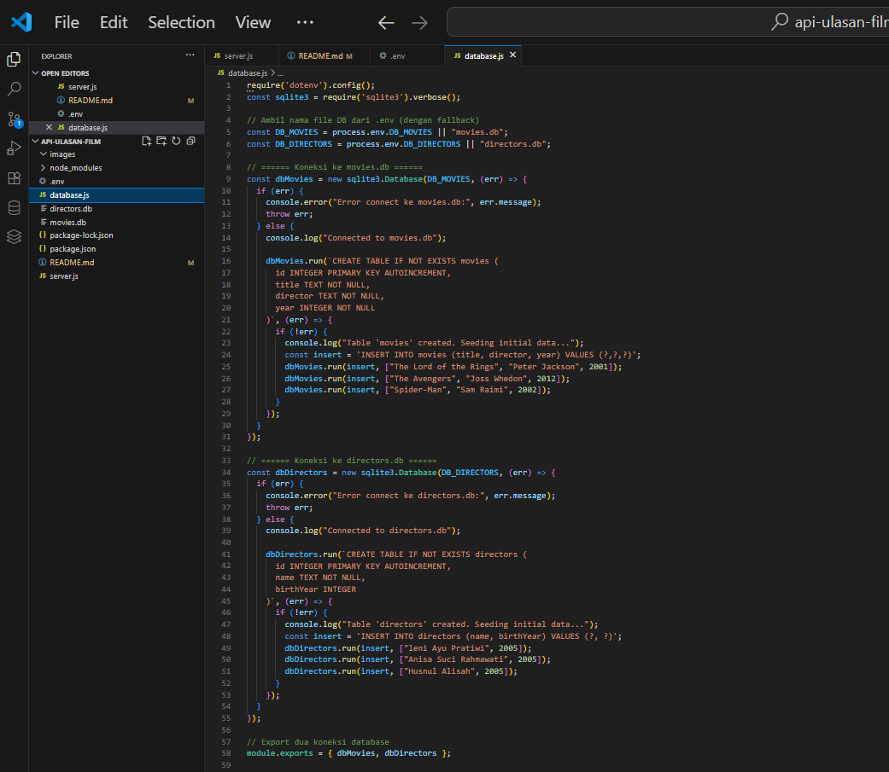
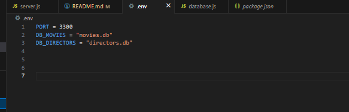
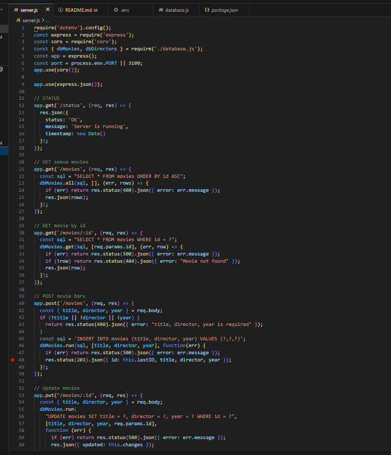
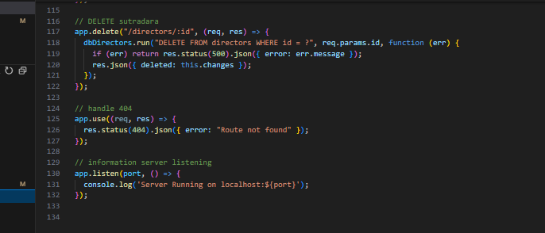

# LAPORAN PRAKTIKUM MDIRECTORS

1. langkah pertama buat file bernama database dan tambahkan kode untuk membuat tabel directors untuk kodenya seperti gambar di bawah ini

File database.js ini merupakan modul konfigurasi database untuk aplikasi Node.js yang menggunakan SQLite sebagai sistem manajemen database

2. buat file yang bernama env dimana  file ini untuk aplikasi web manajemen film dan sutradara kemudian untuk isinya  isikan kode seperti gambar di bawah ini 

3. kemudian masuk pada file server.js yang berfungsi untuk mengolah data movies dan director untuk kodenya pada gambar berikut ini 

